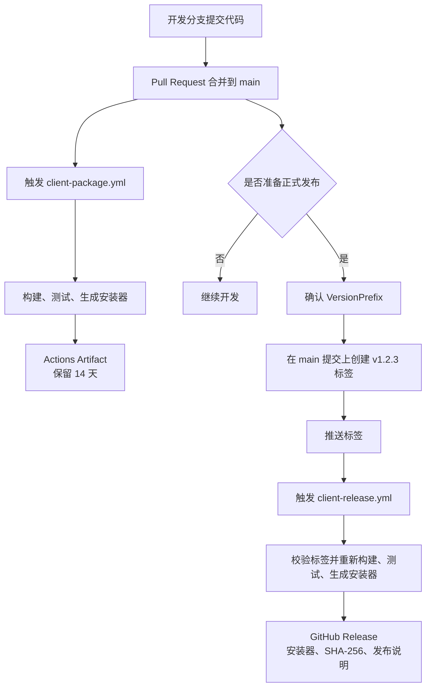

# GitHub Actions Workflows 入门与 Devkit 客户端流程

本文面向第一次接触 GitHub Actions 的开发者，说明 GitHub Workflow 的基本概念，以及 Devkit 仓库中 `client-package.yml` 和 `client-release.yml` 的区别、执行过程和正确使用方法。

## 先看结论

两个工作流都会构建、测试并打包客户端，但用途和最终产物不同：

| 工作流 | 主要用途 | 什么时候运行 | 最终结果 |
| --- | --- | --- | --- |
| `client-package.yml` | 日常持续集成打包，确认 `main` 当前代码可以构建和安装 | 代码推送或合并到 `main`，也可以手动运行 | Actions 页面中保留 14 天的 Artifact |
| `client-release.yml` | 正式发布一个明确版本，供用户长期下载 | 推送符合要求的版本标签，例如 `v0.1.0` | Releases 页面中的正式 GitHub Release |

可以把它们理解为：

- `client-package.yml` 是每天都可以执行的“出厂检测和样品打包”。
- `client-release.yml` 是确认版本后执行的“正式出货”。

合并到 `main` 只会触发日常打包，不会自动发布正式版本。正式发布必须额外创建并推送版本标签。

## 整体流程



## GitHub Actions 是什么

GitHub Actions 是 GitHub 提供的自动化执行平台。仓库中发生某个事件后，GitHub 可以自动准备一台临时计算机，并按照 YAML 文件中写好的步骤执行命令。

常见用途包括：

- 提交代码后自动编译。
- Pull Request 中自动执行测试。
- 生成安装包或构建产物。
- 发布正式版本。
- 部署网站或服务。

GitHub Actions 是平台名称，Workflow 是这个平台上具体的一套自动化流程。

## Workflow 的核心概念

工作流文件必须存放在仓库的 `.github/workflows` 目录中，并使用 `.yml` 或 `.yaml` 扩展名。一个仓库可以包含多个相互独立的工作流。

| 概念 | YAML 中常见位置 | 含义 | 本仓库示例 |
| --- | --- | --- | --- |
| Workflow | 一个完整的 YAML 文件 | 一套完整自动化流程 | `client-package.yml` |
| Event | `on` | 触发工作流的事件 | 推送到 `main`、推送 Tag、手动运行 |
| Job | `jobs` | 一组在同一 Runner 上执行的步骤 | `package`、`release` |
| Runner | `runs-on` | 真正执行命令的计算机 | `windows-2025` |
| Step | `steps` | Job 中按顺序执行的单个步骤 | 检出代码、安装 SDK、执行打包 |
| Action | `uses` | 可复用的标准步骤 | `actions/checkout@v6` |
| Script | `run` | 自己编写的命令 | PowerShell 打包命令 |
| Artifact | `actions/upload-artifact` | 工作流运行产生的临时文件 | CI 安装器和 SHA-256 |
| Release | `gh release create` | 与版本 Tag 关联的正式发布 | `v0.1.0` 正式安装包 |

一个简化的工作流结构如下：

```yaml
name: 示例工作流

on:
  push:
    branches:
      - main

jobs:
  build:
    runs-on: windows-2025
    steps:
      - name: 检出代码
        uses: actions/checkout@v6

      - name: 执行命令
        shell: pwsh
        run: |
          Write-Output "Hello from GitHub Actions"
```

它表达的意思是：有人向 `main` 推送代码时，GitHub 启动一台 Windows Runner，并按顺序执行 `build` Job 中的步骤。

## YAML 中几种容易混淆的语法

### `uses` 和 `run`

`uses` 调用已经封装好的 Action：

```yaml
- uses: actions/checkout@v6
```

`run` 执行当前项目自己的命令：

```yaml
- shell: pwsh
  run: |
    ./src/client/DevkitPrism/packaging/Package-Devkit.ps1
```

### `${{ ... }}` 和 `$env:...`

`${{ ... }}` 是 GitHub Actions 表达式，在命令交给 Runner 之前由 GitHub 计算：

```yaml
${{ github.run_number }}
${{ secrets.GITHUB_TOKEN }}
```

`$env:...` 是 PowerShell 读取环境变量的语法，在 Windows Runner 执行脚本时计算：

```powershell
$env:GITHUB_REF_NAME
$env:RELEASE_VERSION
```

### `|` 和 PowerShell 反引号

YAML 中的 `|` 表示下面是多行文本。PowerShell 行尾的反引号表示同一条命令继续到下一行：

```yaml
run: |
  ./Package-Devkit.ps1 `
    -Version $env:RELEASE_VERSION
```

## 两个工作流的详细区别

| 对比项 | `client-package.yml` | `client-release.yml` |
| --- | --- | --- |
| 定位 | CI 打包和验证 | 正式版本发布 |
| 自动触发条件 | `main` 分支发生 push | `v*` 标签发生 push |
| 手动触发 | 支持 `workflow_dispatch` | 当前不支持手动触发 |
| 版本来源 | 手动输入，或 `<VersionPrefix>-ci.<运行编号>` | Tag 去掉开头的 `v` |
| Tag 格式 | 不涉及 | 必须严格为 `v1.2.3` |
| 是否要求提交属于 `main` | 触发点本身就是 `main` | 会主动检查 Tag 提交属于 `main` |
| 仓库权限 | `contents: read` | `contents: write` |
| 产物位置 | Actions 运行记录下的 Artifact | 仓库 Releases 页面 |
| 保留方式 | 当前明确设置为 14 天 | 随 Release 保留，直到 Release 或附件被删除 |
| 面向对象 | 开发者、测试人员 | 正式安装包使用者 |
| 是否生成发布说明 | 否 | 是，GitHub 自动生成 |
| 并发策略 | 同一 ref 的新运行取消旧运行 | 不取消正在进行的同一 ref 发布 |

## `client-package.yml` 的作用和执行过程

文件位置：[`.github/workflows/client-package.yml`](../../.github/workflows/client-package.yml)。

### 触发条件

```yaml
on:
  push:
    branches:
      - main
  workflow_dispatch:
```

它有两种启动方式：

1. `main` 收到新的 push。
2. 在 GitHub Actions 页面手动点击 **Run workflow**。

Pull Request 合并到 `main` 后，本质上会让 `main` 出现新的提交，因此属于第一种情况。Workflow 监听的不是“点击了合并按钮”，而是“`main` 出现了 push”。

### 权限

```yaml
permissions:
  contents: read
```

这个工作流只能读取仓库内容。它可以检出代码和上传 Actions Artifact，但没有权限创建 Tag 或 GitHub Release。

### 并发控制

```yaml
concurrency:
  group: client-package-${{ github.ref }}
  cancel-in-progress: true
```

如果同一个分支很快连续推送两次，较新的运行会取消仍在执行的旧运行。因为通常只关心最新代码能否打包，这样可以减少重复构建。

### Runner

```yaml
runs-on: windows-2025
timeout-minutes: 30
```

GitHub 会准备一台 Windows Runner，整个 Job 最多执行 30 分钟。客户端和 Inno Setup 安装器都依赖 Windows，因此不能随意改成 Ubuntu Runner。

### 具体步骤

1. `actions/checkout@v6`：把触发本次运行的仓库代码下载到 Runner。
2. `actions/setup-dotnet@v5`：按照仓库 `global.json` 准备 .NET SDK。
3. `Package client`：调用项目唯一的打包脚本。
4. 查找安装器：必须恰好生成一个 `Devkit-Setup-*-win-x64.exe`，否则运行失败。
5. `actions/upload-artifact@v4`：把 EXE 和 SHA-256 上传到本次 Actions 运行记录。

打包脚本会执行：

```text
restore → Release build → test → publish → 汇总模块 → 编译安装器 → 生成 SHA-256
```

中间任何一步失败，后续上传步骤都不会执行。

### 版本如何产生

自动运行没有手动版本输入，因此使用：

```text
<VersionPrefix>-ci.<github.run_number>
```

假设 `VersionPrefix` 是 `0.1.0`，本工作流是第 17 次运行，安装器版本就是：

```text
0.1.0-ci.17
```

这表示它是 CI 构建，不是 `0.1.0` 正式版本。

手动运行时可以填写完整版本，例如 `0.2.0`。这只会改变本次安装器版本并生成 Artifact，仍然不会创建正式 Release。

### 在哪里查看结果

1. 打开 GitHub 仓库。
2. 进入 **Actions**。
3. 在左侧选择 **Package Devkit Client**。
4. 打开某次运行。
5. 在页面底部的 **Artifacts** 区域下载安装包。

当前 Artifact 明确保留 14 天，过期后不能再从该次运行下载。

## `client-release.yml` 的作用和执行过程

文件位置：[`.github/workflows/client-release.yml`](../../.github/workflows/client-release.yml)。

### 触发条件

```yaml
on:
  push:
    tags:
      - "v*"
```

只有推送以 `v` 开头的 Tag 才会启动。普通分支 push、Pull Request 合并和 Actions 页面手动操作都不会启动它。

`v*` 是第一层触发过滤。工作流内部还有更严格的正则校验，所以当前只接受稳定版本格式：

```text
v0.1.0
v1.2.3
v10.20.30
```

以下格式当前都会失败：

```text
0.1.0
v0.1
v1.2.3-beta.1
```

### 为什么需要写权限

```yaml
permissions:
  contents: write
```

正式发布需要在仓库中创建 Release 并上传 Release Assets，因此需要 `contents: write`。这个权限只配置在 Release Job 中；日常打包工作流仍然保持只读权限。

GitHub 会为 Job 自动创建临时 `GITHUB_TOKEN`。工作流把它作为 `GH_TOKEN` 交给 GitHub CLI，不需要在仓库中保存个人访问令牌。

### 为什么完整检出 Git 历史

```yaml
with:
  fetch-depth: 0
```

默认检出通常只需要当前提交。Release 工作流需要判断 Tag 指向的提交是否包含在 `main` 历史中，所以必须获取完整 Git 历史。

### 发布前的三项校验

#### 1. Tag 格式正确

Tag 必须严格符合 `v1.2.3`，避免把随意命名的 Tag 误发布为正式版本。

#### 2. Tag 版本与源码版本一致

工作流读取：

```text
src/client/DevkitPrism/Directory.Build.props
```

其中的 `VersionPrefix` 必须与 Tag 去掉 `v` 后的版本一致。例如：

| `VersionPrefix` | Tag | 结果 |
| --- | --- | --- |
| `0.1.0` | `v0.1.0` | 通过 |
| `0.1.0` | `v0.2.0` | 失败 |
| `0.2.0` | `v0.2.0` | 通过 |

这样可以避免源码显示 `0.1.0`，Release 和安装器却显示 `0.2.0`。

#### 3. Tag 指向的提交属于 `main`

工作流会获取远端 `main`，再使用 `git merge-base --is-ancestor` 检查 Tag 对应提交是否在 `main` 历史中。

这可以阻止直接从尚未合并的功能分支发布正式版本。

### 重新执行完整打包

Release 工作流不会直接拿之前某次 CI 的 Artifact 发布，而是针对 Tag 指向的确切提交重新执行完整打包脚本。

这样能够保证：

- Release 对应的源码提交明确。
- 正式发布时测试仍然通过。
- 安装器版本与 Tag 完全一致。
- 不依赖可能已经过期的 CI Artifact。

### 创建 Release

打包成功后执行的核心命令是：

```powershell
gh release create "$env:GITHUB_REF_NAME" `
  "./build/client/package/*.exe" `
  "./build/client/package/*.sha256" `
  --verify-tag `
  --generate-notes
```

参数含义：

- `release create`：创建 GitHub Release。
- `GITHUB_REF_NAME`：当前 Tag 名，例如 `v0.1.0`。
- `*.exe` 和 `*.sha256`：上传安装器和校验文件。
- `--verify-tag`：要求 Tag 已经存在，不允许命令静默创建新 Tag。
- `--generate-notes`：让 GitHub 根据提交和 Pull Request 自动生成发布说明。

只有前面的 Tag 校验、构建、测试、发布和安装器生成全部成功后，这一步才会执行。

### 在哪里查看结果

正式发布成功后可以从两个位置查看：

- **Actions → Release Devkit Client**：查看执行日志。
- 仓库主页右侧的 **Releases**：查看正式版本、发布说明和下载附件。

## 三种容易混淆的“发布”

本项目的日志和文档中会同时出现 `Release`、`publish` 和 GitHub Release，它们不是一回事：

| 名称 | 实际含义 | 是否会出现在 GitHub Releases 页面 |
| --- | --- | --- |
| `.NET Release` 构建 | 使用优化后的正式构建配置编译代码，与 `Debug` 配置相对 | 否 |
| `dotnet publish` | 整理应用程序及其运行依赖，产生可以部署的文件目录 | 否 |
| GitHub Release | 在 GitHub 上建立与 Tag 关联的正式版本记录，并上传附件 | 是 |

`client-package.yml` 也会执行 `.NET Release` 构建和 `dotnet publish`，但最后只上传 Artifact，所以它依然不是 GitHub Release。只有 `client-release.yml` 最后的 `gh release create` 才会真正创建 GitHub Release。

## Artifact 与 Release 的区别

这是理解两个工作流最关键的地方。

| 对比项 | Actions Artifact | GitHub Release |
| --- | --- | --- |
| 主要目的 | 保存某次工作流的构建结果 | 向使用者交付一个明确版本 |
| 所属位置 | 某次 Actions 运行记录 | 仓库 Releases 页面 |
| 是否必须关联版本 Tag | 否 | 是 |
| 是否有发布说明 | 通常没有 | 有，可以自动生成 |
| 当前保留时间 | 14 天 | 不使用 Artifact 保留期 |
| 适合长期下载 | 否 | 是 |
| 适合测试 CI 安装包 | 是 | 通常不用于临时测试 |
| 删除工作流运行的影响 | Artifact 会随运行删除 | Release 不依赖原 Actions 运行记录 |

因此，不应把 CI Artifact 当作正式发布，也不应让每次合并都自动创建 GitHub Release。

## 两个工作流为什么要分开

### 发布频率不同

`main` 可能每天合并多次，但正式版本通常只在确认功能、测试和版本号后发布。

### 权限不同

日常打包只需要读取代码。正式发布需要写入 Release。分开后可以遵循最小权限原则，避免所有 CI 运行都持有写权限。

### 版本语义不同

CI 版本带有 `-ci.<编号>`，表示临时构建；正式 Release 使用 `v1.2.3` Tag，表示一个可以长期追踪的版本。

### 生命周期不同

Artifact 会过期；Release 是正式交付记录，应与 Tag、发布说明和安装器一起保留。

## 日常开发时如何使用

一般不需要手动做任何事情：

1. 在开发分支完成代码。
2. 创建 Pull Request。
3. 合并到 `main`。
4. `client-package.yml` 自动运行。
5. 在 Actions 页面确认运行成功。
6. 如需测试安装器，从本次运行的 Artifacts 下载。

如果只想手动生成一个 CI 安装包：

1. 打开仓库的 **Actions** 页面。
2. 选择 **Package Devkit Client**。
3. 点击 **Run workflow**。
4. 选择分支；版本输入可以留空。

也可以使用 GitHub CLI：

```powershell
gh workflow run client-package.yml -f version=0.1.0
```

手动输入版本不会把 Artifact 变成 Release。

## 正式发布时如何使用

假设准备发布 `0.2.0`。

### 第一步：更新源码版本

把 `src/client/DevkitPrism/Directory.Build.props` 中的版本修改为：

```xml
<VersionPrefix>0.2.0</VersionPrefix>
```

版本修改应通过正常分支和 Pull Request 合并到 `main`。

### 第二步：等待 `main` 打包通过

确认对应 `main` 提交的 **Package Devkit Client** 运行成功。虽然 Release 工作流还会重新测试，但先确认 CI 成功可以减少错误 Tag。

### 第三步：在最新 `main` 上创建 Tag

```powershell
git switch main
git pull --ff-only
git tag -a v0.2.0 -m "Devkit v0.2.0"
git push origin v0.2.0
```

注意：必须先把 `client-release.yml` 合并到 `main`，再创建 Tag。GitHub 会使用 Tag 所指提交中存在的工作流文件；如果那个提交还没有 Release 工作流，就不会触发。

### 第四步：检查 Actions

进入：

```text
GitHub 仓库 → Actions → Release Devkit Client
```

依次确认：

1. Tag 校验成功。
2. 构建和测试成功。
3. 安装器生成成功。
4. `Create GitHub Release` 成功。

### 第五步：检查 Release

进入仓库 **Releases** 页面，确认：

- Release 标题和 Tag 均为 `v0.2.0`。
- 存在 `Devkit-Setup-0.2.0-win-x64.exe`。
- 存在对应 `.sha256` 文件。
- 发布说明已生成。

## 如何阅读 Actions 运行状态

| 状态 | 含义 | 建议 |
| --- | --- | --- |
| Queued | 正在等待 Runner | 等待 GitHub 分配执行环境 |
| In progress | 正在执行 | 打开 Job 查看当前步骤 |
| Success | 全部必需步骤成功 | 检查 Artifact 或 Release |
| Failure | 某一步返回失败 | 打开红色步骤查看第一处明确错误 |
| Cancelled | 被取消 | 检查是否被新运行取代或被人工取消 |
| Skipped | 条件不满足，步骤未运行 | 检查前置步骤和 `if` 条件 |

排查时优先查看第一个失败步骤。后面的步骤经常只是因为前一步失败而没有执行，不一定是新的问题。

## 常见失败场景

### `client-package.yml`

| 场景 | 表现 | 原因或处理方向 |
| --- | --- | --- |
| 成功 | 出现 EXE 和 SHA-256 Artifact | 构建、测试和安装器均通过 |
| 网络或服务器失败 | `dotnet restore` 失败 | NuGet 源不可访问、网络异常或源服务器故障 |
| 配置缺失 | SDK、Inno Setup 或预期文件错误 | 检查 `global.json`、Runner 环境和打包输入 |
| 测试失败 | `dotnet test` 返回非零 | 修复测试或业务代码，工作流不会跳过测试 |
| 没有 Artifact | Upload 步骤未执行或失败 | 通常先检查前面的打包步骤 |

### `client-release.yml`

| 场景 | 表现 | 原因或处理方向 |
| --- | --- | --- |
| 成功 | Releases 页面出现版本和两个附件 | 所有校验与打包步骤通过 |
| Tag 格式错误 | 提示必须使用 `v1.2.3` | 当前不支持缺少 `v`、缺少版本段或预发布标签 |
| 版本配置不一致 | 提示 Tag 与 `VersionPrefix` 不匹配 | 先在源码中更新版本并合并到 `main` |
| Tag 不属于 `main` | 提示 Tag 必须指向 `main` 中的提交 | 不要直接从未合并功能分支发布 |
| 网络或服务器失败 | fetch、restore 或 GitHub API 失败 | 检查 GitHub/NuGet 服务状态后重试 |
| 配置或权限缺失 | 创建 Release 返回 403 等错误 | 检查 Job 的 `contents: write` 和仓库 Actions 策略 |
| Release 已存在 | `gh release create` 失败 | 不要重复发布同一个版本；先确认 Releases 页面状态 |

## 权限与安全

### `GITHUB_TOKEN`

每个 Job 开始时，GitHub 会自动生成仅限当前仓库使用的临时 `GITHUB_TOKEN`，Job 结束后失效。当前 Release 工作流通过以下方式把它提供给 GitHub CLI：

```yaml
env:
  GH_TOKEN: ${{ secrets.GITHUB_TOKEN }}
```

不应把个人访问令牌、密码或其他凭据直接写入 YAML。

### 最小权限

- `client-package.yml`：`contents: read`。
- `client-release.yml`：Release Job 使用 `contents: write`。

不要为了方便把所有工作流都改成 `write-all`。

### 第三方 Action

`uses: owner/action@version` 表示执行仓库外提供的可复用 Action。修改 Action 名称或版本前，应确认来源、用途和官方升级说明。当前两个工作流使用 GitHub 官方的 `actions/checkout`、`actions/setup-dotnet` 和 `actions/upload-artifact`。

## 常见问题

### 合并到 `main` 后为什么 Releases 页面仍然为空？

因为合并只触发 `client-package.yml`。它上传 Artifact，不创建 Release。只有推送合规版本 Tag 才触发 `client-release.yml`。

### 为什么正式发布还要重新构建一次？

Release 必须证明 Tag 对应的确切代码能够通过测试并生成安装器。之前的 CI Artifact 可能来自不同提交，也可能已经过期。

### 手动运行 `client-package.yml` 并填写 `0.2.0`，会创建 Release 吗？

不会。版本输入只影响安装器文件名和程序集版本，输出仍然是临时 Artifact。

### 可以直接在功能分支创建正式 Tag 吗？

不可以。Release 工作流会检查 Tag 提交是否属于 `main`，不满足时立即失败。

### 当前支持 `v1.2.3-beta.1` 吗？

不支持。当前正式发布工作流只接受 `v1.2.3` 三段稳定版本。如需预发布版本，需要单独设计 Tag 校验和 `--prerelease` 行为。

### 需要配置 PAT 吗？

不需要。当前权限范围内使用 GitHub 自动生成的 `GITHUB_TOKEN` 即可。

### Release 成功后可以删除 Tag 吗？

不建议。Release 以 Tag 标记的代码历史位置为基础。已发布版本的 Tag 应保持稳定，不应移动或复用。

## 修改工作流时的检查清单

修改 `.github/workflows` 下的文件时，至少确认：

- 触发条件是否会造成意外运行或漏运行。
- Runner 操作系统是否满足构建要求。
- 权限是否遵循最小权限原则。
- 构建和正式发布是否仍调用同一个打包入口。
- 失败时是否会阻止上传或发布不完整产物。
- 版本来源是否唯一且可追踪。
- Artifact 和 Release 是否没有被混为一谈。
- YAML 语法和 GitHub Actions 表达式是否有效。
- 操作文档是否与实际工作流同步。

## 相关文件

- [持续集成打包工作流](../../.github/workflows/client-package.yml)
- [正式发布工作流](../../.github/workflows/client-release.yml)
- [客户端打包与安装](./packaging.md)
- [客户端版本基线](../../src/client/DevkitPrism/Directory.Build.props)
- [客户端打包脚本](../../src/client/DevkitPrism/packaging/Package-Devkit.ps1)

## GitHub 官方资料

- [理解 GitHub Actions](https://docs.github.com/en/actions/get-started/understand-github-actions)
- [Workflow 概念](https://docs.github.com/en/actions/concepts/workflows-and-actions/workflows)
- [Workflow YAML 语法](https://docs.github.com/en/actions/reference/workflows-and-actions/workflow-syntax)
- [保存和共享 Workflow Artifacts](https://docs.github.com/actions/configuring-and-managing-workflows/persisting-workflow-data-using-artifacts)
- [关于 GitHub Releases](https://docs.github.com/en/repositories/releasing-projects-on-github/about-releases)
- [在工作流中使用 `GITHUB_TOKEN`](https://docs.github.com/en/actions/tutorials/authenticate-with-github_token)
